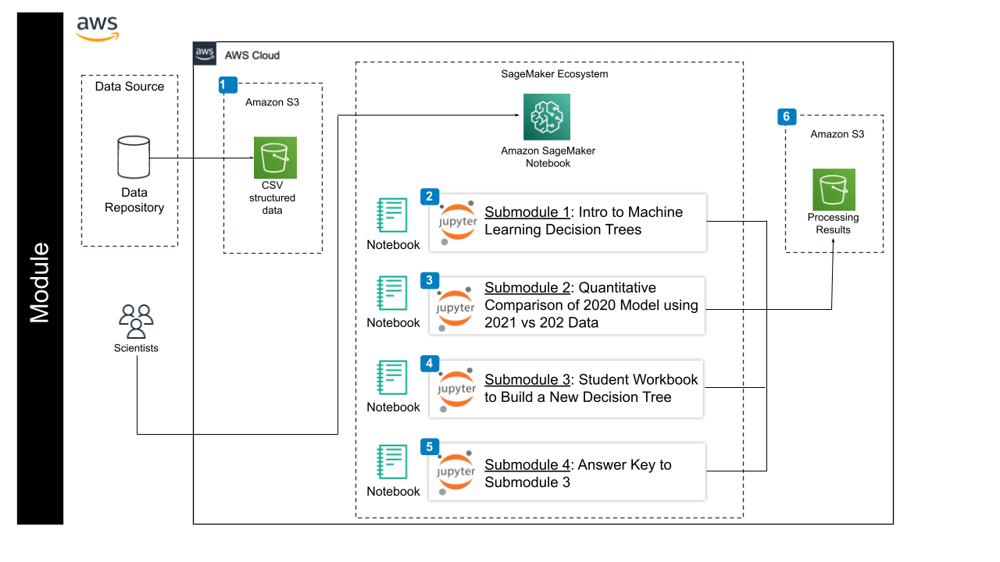

## Introduction to Machine Learning for COVID Predictions for AWS
---------------------------------

## Contents

+ [Overview](#overview)
+ [Background](#background)
+ [Before Starting](#before-starting)
+ [Getting Started](#getting-started)
+ [Software Requirements](#software-requirements)
+ [Architecture Design](#architecture-design)
+ [Data](#data)
+ [Funding](#funding)

## **Overview** 

This module teaches you how to create a simple Decision Tree using a structured dataset. In addition to the overview given in this README you will find the four Jupyter notebooks. The second notebook is optional.
- **1- Intro to Machine Learning: Decision Trees**: This notebook provides a basic introduction to Machine Learning concepts, steps for creating and understanding a Decision Tree model, making predictions with it, and intuitively evaluating its performance. 

- **2- (Optional) Quant. Comparison of 2020 DT Model Performance for (2020 vs 2021) Data**: This notebook is optional, for students who would like to know a bit more about how to evaluate model performance quantitatively, and offers an introduction to why machine learning models require retraining from time to time. 

- **3- Practice**: This notebook provides a way to practice and test what you have learned from the first notebook. It includes basic instructions outlining every step discussed in the first notebook. Students are free to either copy and modify the code from the first notebook or they can choose to write it themselves.

- **4- Practice - Answer Key**: This notebook provides the answers and explanation to the previous Practice exercise notebook. Check this notebook only after you have tried to complete the previous exercise yourself. 

This module will cost you about ~$1.00 to run, assuming you tear down all resources upon completion.

## Background 
This module is geared towards beginners and does not require prior knowledge on a specific scientific discipline. The module is divided into three Jupyter notebooks as outlined at the beginning of this document. In addition to the notebooks mentioned, there are videos containing brief explanations about basic concepts in machine learning and what the code does in each step of the notebook. Below is an outline of the videos contained in each notebook with their respective links. These videos are already attached to the notebook.

### 1- Introduction To Machine Learning: Decision Trees (10 video clips)

- [Introduction Video by Lorena Benitez](https://youtu.be/e3tGQykFC5M)
- [Objectives of Exercise](https://youtu.be/_kAjJ8rJwfU)
- [Step 1: Importing necessary packages into Google Colab](https://youtu.be/jPIQbpdTkbM)
- [Step 2: Loading training data and making sure it looks correct](https://youtu.be/z9dcLYg65uk)
- [Step 3: Separate the training dataset into features and labels](https://youtu.be/qh8C0QRECWU)
- [Step 4: Create a decision tree object and train it](https://youtu.be/M6gY_JywOys)
- [Step 5: Visualize our trained decision tree](https://youtu.be/cFk6vmfU48w)
- [Step 6: Make predictions using testing data with our trained decision tree](https://youtu.be/LtD93dB5JzU)
- [Step 7: Let's see how our decision tree model performed](https://youtu.be/0VK4sLz2wrc)
- [Step 8: Let's try using our summer 2020 tree model to predict 2021 data](https://youtu.be/2r3ZpwM6xDQ)

### 2-  (Optional) Quant. Comparison of 2020 DT Model Performance for (2020 vs 2021) Data

### 3-  Practice Exercise ( 1 video clip)
- [Walkthrough Solution](https://youtu.be/eHI4wMjSGuU)
### 4- Practice Exercise - Answer Key (1 video clip )
- [Walkthrough Solution](https://youtu.be/eHI4wMjSGuU)

## Before Starting

Included is a tutorial in the form of Jupyter notebooks. The main purpose of the tutorial is to help beginners without much coding experience to familiarize themselves with basic fundamental concepts within machine learning using health data (COVID dataset). It is also meant to be extended to other kinds of structured data. The tutorial walks through step by step the process of creating a Decision Tree and interpreting it. This module intends to provide an intuitive understanding of how machine learning model performance is evaluated. In order to get to this module from the AWS Cloud, you will need to have access to an AWS account, this module is located within Amazon SageMaker. For more technical information about AWS please click [this link.](https://github.com/STRIDES/NIHCloudLabAWS)

## **Getting Started**

**1)** Follow the steps highlighted [here](https://github.com/NIGMS/NIGMS-Sandbox/blob/main/docs/HowToCreateAWSSagemakerNotebooks.md) to create a new user-managed notebook in Amazon SageMaker. Follow steps and be especially careful to enable idle shutdown as highlighted. For this module, in [step 4](https://github.com/NIGMS/NIGMS-Sandbox/blob/main/docs/HowToCreateAWSSagemakerNotebooks.md#:~:text=Give%20a%20name%20to%20your%20notebook.%20Choose%20a%20notebook%20instance%20type%20based%20on%20needs%2C%20Amazon%20Linux%202%20as%20platform%20identifier%2C%20volume.%20Optional%2C%20create%20idle%2Dshut%20by%20selecting%20create%20new%20lifecycle%20configuration%20and%20copy%20and%20paste%20idle%2Dshutdown.sh%20and%20create%20configuration.%20Then%20click%20Create%20notebook%20instance%3A) in the "Notebook instance type" tab, select ml.m5.xlarge from the dropdown box. Select conda_python3 kernel in [step 8](https://github.com/NIGMS/NIGMS-Sandbox/blob/AWS%26GCP/docs/HowToCreateAWSSagemakerNotebooks.md#:~:text=Select%20a%20notebook%20and%20then%20kernel%3A).

**2)** Now you will need to download the tutorial files from GitHub. The easiest way to do this would be to clone the repository from NIGMS into your Amazon SageMaker notebook. To clone this repository, use the `Git` command `git clone https://github.com/NIGMS/Introduction-to-Data-Science-for-Biology.git` in the terminal as it illustrated in [step 9](https://github.com/NIGMS/NIGMS-Sandbox/blob/SageMakerTutorial/docs/HowToCreateAWSSagemakerNotebooks.md#:~:text=To%20clone%20in,see%20the%20repo). Please make sure you only enter the link for the repository that you want to clone. There are other bioinformatics related learning modules available in the [NIGMS Repository](https://github.com/NIGMS). This will download our tutorial files into a folder called `Introduction-to-Data-Science-for-Biology`.

**IMPORTANT NOTE** 

Make sure that after you are done with the module, close the tab that appeared when you clicked **OPEN JUPYTERLAB**, then check the box next to the name of the notebook you created in [step 3](https://github.com/NIGMS/NIGMS-Sandbox/blob/AWS%26GCP/docs/HowToCreateAWSSagemakerNotebooks.md#:~:text=Click%20Create%20notebook%20instance%3A). Then click on **STOP** at the top of the Workbench menu. Wait and make sure that the icon next to your notebook is grayed out.

## **Software Requirements**

Software requirements are satisfied by using a pre-made AWS environment SageMaker Notebook. Software requirements are described in notebook **"Intro to Machine Learning Decision Trees"** step 1. 

    
## **Architecture Design**

Submodule 1 and Submodule 3 will download CSV files stored in an Amazon S3 bucket to the SageMaker notebook, then it will output additional CSV files that will be used optionally if students want to work on the (optional) Submodule 2. Below is a diagram that illustrates our workflow:~

## **Data** 
All original data from this module was originally sourced from the following sites: 

- [COVID cases data (California Health and Human Services Agency)](https://data.chhs.ca.gov/dataset/covid-19-time-series-metrics-by-county-and-state/resource/046cdd2b-31e5-4d34-9ed3-b48cdbc4be7a)
- [COVID vaccination data (Los Angeles Times)](https://github.com/datadesk/california-coronavirus-data)
- [Unemployment data (California Employment Development Dept.)](https://data.edd.ca.gov/Labor-Force-and-Unemployment-Rates/Local-Area-Unemployment-StatisticsdecisionLAUS-/e6gw-gvii)
- [Election data (Harvard University)](https://dataverse.harvard.edu/dataset.xhtml?persistentId=doi:10.7910/DVN/VOQCHQ)

We subsequently picked only certain variables of interest, cleaned and created a composite dataset for the years 2020 and 2021 from the sources listed above. **We manipulated the variable named "Unemployment_rate" by using the 2020 rates in both the 2020 and 2021 Datasets**. We then separated these datasets into training, validation, and testing sets for each of these years to streamline the tutorials. Finally, we stored them in our group's [SFSU GitHub repository](https://github.com/MarcMachineLearning/Introduction-to-Machine-Learning/tree/main/Datasets). 

## **Funding**

- SFSU/UCSF M.S. Bridges to the Doctorate Program: cloud-based learning modules supplement (T32GM142515)
- Demystifying Machine Learning and Best Data Practices Workshop Series for Underrepresented STEM Undergraduate and MS Researchers bound for PhD Training Programs (T34-GM008574)
- The creation of this training module was supported by the National Institute Of General Medical Sciences of the National Institutes of Health under Award Number 3T32GM142515-01S1

## **License for Data**

Text and materials are licensed under a Creative Commons CC-BY-NC-SA license. The license allows you to copy, remix and redistribute any of our publicly available materials, under the condition that you attribute the work (details in the license) and do not make profits from it. More information is available [here](https://tilburgsciencehub.com/about/#license).

This work is licensed under a [Creative Commons Attribution-NonCommercial-ShareAlike 4.0 International License](http://creativecommons.org/licenses/by-nc-sa/4.0/)
