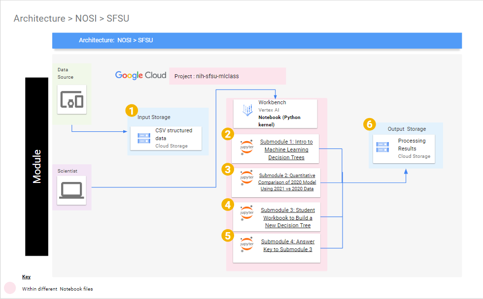

## Overview of Page Contents

+ [Getting Started](#getting-started)
+ [Software Requirements](#software-requirements)
+ [Workflow Diagrams](#workflow-diagrams)

## **Getting Started**

Included is a tutorial in the form of Jupyter notebooks. The main purpose of the tutorial is to help beginners without much coding experience to familiarize themselves with basic fundamental concepts within machine learning using health data (COVID dataset). It is also meant to be extended to other kinds of structured data. The tutorial walks through step by step the process of creating a Decision Tree and interpreting it. This module intends to provide an intuitive understanding of how machine learning model performance is evaluated. In order to get to this module from the Google Cloud Platform, you will need to have access to a Google Cloud Platform account, this module is located within Vertex AI Workbench. For more technical information about Google Cloud Platform please click on the following link: [NIH Cloud Lab README](https://github.com/STRIDES/NIHCloudLabGCP)

**1)** Please click on the link for steps to open your GCP project: [How to open your GCP Project](https://github.com/STRIDES/NIHCloudLabGCP/blob/main/docs/open_project_intramural.md).

**2)** Follow the steps highlighted [here](https://github.com/STRIDES/NIHCloudLabGCP/blob/main/docs/vertexai.md) to create a new user-managed notebook in Vertex AI. Follow steps 1-8 and be especially careful to enable idle shutdown as highlighted in step 7. For this module you should select Debian 11 and Python 3 in the Environment tab in step 5. In step 6 in the Machine type tab, select n1-standard-4 from the dropdown box.

**3)** Now you will need to download the tutorial files from GitHub. The easiest way to do this would be to clone the repository from NIGMS into your Vertex AI notebook. This can be done by using the `Git` menu in JupyterLab, and selecting the clone option. To clone this repository, use the Git command `git clone https://github.com/NIGMS/Introduction-to-Data-Science-for-Biology.git` in the dropdown menu option in Jupyter notebook. Please make sure you only enter the link for the repository that you want to clone. There are other bioinformatics related learning modules available in the [NIGMS Repository](https://github.com/NIGMS). This will download our tutorial files into a folder called `Introduction-to-Data-Science-for-Biology`.

**IMPORTANT NOTE** 

Make sure that after you are done with the module, close the tab that appeared when you clicked **OPEN JUPYTERLAB**, then check the box next to the name of the notebook you created in step 3. Then click on **STOP** at the top of the Workbench menu. Wait and make sure that the icon next to your notebook is grayed out.

## **Software Requirements**

Software requirements are satisfied by using a pre-made Google Cloud Platform environment Workbench Notebook. The notebook environment used is named **"Python 3 with Intel® MKL"** ; and it is listed during Step 3 for accessing our module. In addition all package requirements are installed by following the instructions Step 1 of the notebook **"Intro to Machine Learning Decision Trees".**
    
## **Workflow Diagrams**

Submodule 1 and Submodule 3 will download CSV files stored in a Google Cloud Storage bucket to the Workbench notebook, then it will output additional CSV files that will be used optionally if students want to work on the (optional) Submodule 2. Below is a diagram that illustrates our workflow:

