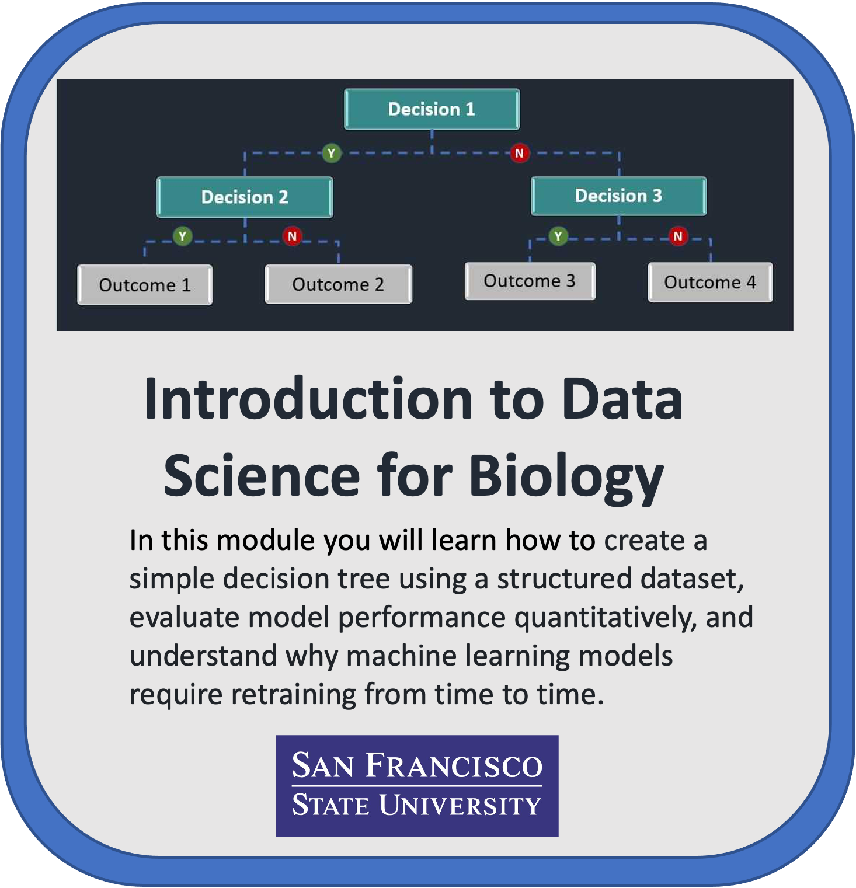

# Introduction to Machine Learning for COVID Predictions
## San Francisco State University   

 

    

## Contents

+ [Overview](#overview)
+ [Getting Started](#getting-started)
+ [Software Requirements](#software-requirements)
+ [Data](#data)
+ [Funding](#funding)

## **Overview**

This module is geared towards beginners and does not require prior knowledge on a specific scientific discipline. The module is divided into three Jupyter notebooks as outlined at the beginning of this document. In addition to the notebooks mentioned, there are videos containing brief explanations about basic concepts in machine learning and what the code does in each step of the notebook. Below is an outline of the videos contained in each notebook with their respective links. These videos are already attached to the notebook.

This module offers two computing pathways: [AWS (Amazon Web Services)](https://github.com/NIGMS/Introduction-to-Data-Science-for-Biology/tree/master/AWS) or [GCP (Google Cloud Platform)](https://github.com/NIGMS/Introduction-to-Data-Science-for-Biology/tree/master/GoogleCloud). Users can choose their preferred cloud service to run the Jupyter notebooks, ensuring flexibilty and accessibilty based on their existing infrastructure or familairty. Detailed instructions for setting up and using either AWS or GCP for this module are provided within their corresponding folders within this repository. 

### 1- Introduction To Machine Learning: Decision Trees (10 video clips)

- [Introduction Video by Lorena Benitez](https://youtu.be/e3tGQykFC5M)
- [Objectives of Exercise](https://youtu.be/_kAjJ8rJwfU)
- [Step 1: Importing necessary packages into Google Colab](https://youtu.be/jPIQbpdTkbM)
- [Step 2: Loading training data and making sure it looks correct](https://youtu.be/z9dcLYg65uk)
- [Step 3: Separate the training dataset into features and labels](https://youtu.be/qh8C0QRECWU)
- [Step 4: Create a decision tree object and train it](https://youtu.be/M6gY_JywOys)
- [Step 5: Visualize our trained decision tree](https://youtu.be/cFk6vmfU48w)
- [Step 6: Make predictions using testing data with our trained decision tree](https://youtu.be/LtD93dB5JzU)
- [Step 7: Let's see how our decision tree model performed](https://youtu.be/0VK4sLz2wrc)
- [Step 8: Let's try using our summer 2020 tree model to predict 2021 data](https://youtu.be/2r3ZpwM6xDQ)

### 2-  (Optional) Quant. Comparison of 2020 DT Model Performance for (2020 vs 2021) Data

### 3-  Practice Exercise ( 1 video clip)
- [Walkthrough Solution](https://youtu.be/eHI4wMjSGuU)
### 4- Practice Exercise - Answer Key (1 video clip )
- [Walkthrough Solution](https://youtu.be/eHI4wMjSGuU)

This module teaches you how to create a simple Decision Tree using a structured dataset. In addition to the overview given in this README you will find the four Jupyter notebooks. The second notebook is optional.

- **1- Intro to Machine Learning: Decision Trees**: This notebook provides a basic introduction to Machine Learning concepts, steps for creating and understanding a Decision Tree model, making predictions with it, and intuitively evaluating its performance. 

- **2- (Optional) Quant. Comparison of 2020 DT Model Performance for (2020 vs 2021) Data**: This notebook is optional, for students who would like to know a bit more about how to evaluate model performance quantitatively, and offers an introduction to why machine learning models require retraining from time to time. 

- **3- Practice**: This notebook provides a way to practice and test what you have learned from the first notebook. It includes basic instructions outlining every step discussed in the first notebook. Students are free to either copy and modify the code from the first notebook or they can choose to write it themselves.

- **4- Practice - Answer Key**: This notebook provides the answers and explanation to the previous Practice exercise notebook. Check this notebook only after you have tried to complete the previous exercise yourself. 

## **Getting Started**

Included is a tutorial in the form of Jupyter notebooks. The main purpose of the tutorial is to help beginners without much coding experience to familiarize themselves with basic fundamental concepts within machine learning using health data (COVID dataset). It is also meant to be extended to other kinds of structured data. The tutorial walks through step by step the process of creating a Decision Tree and interpreting it. This module intends to provide an intuitive understanding of how machine learning model performance is evaluated. 

To access this module, you will need to choose the corresponding folder (AWS or GCP) within the repository. Further instructions are contained within each folder to guide you through the setup process.

For ***Google Cloud Platform (GCP):***
1. Detailed instructions for setting up and using GCP for this module are provided within the GoogleCloud folder in the repository. 
2. Follow the steps to create a new user-managed notebook in Vertex AI Workbench, ensuring you select the appropriate configurations as outlined in the GCP instructions.
3. Clone the repository from NIGMS into your Vertex AI notebook using the Git command: 
    git clone https://github.com/NIGMS/Introduction-to-Data-Science-for-Biology.git 
    This will download our tutorial files into a folder called Introduction-to-Data-Science-for-Biology
    
For ***Amazon Web Services (AWS):*** 
1. Detailed instructions for setting up and using AWS for this module are provided within the AWS folder in the repository. 
2. Follow the steps to create a new Jupyter notebook instance in Amazon SageMaker, ensuring you select the appropriate configurations as outlined in the AWS instructions.
3. Clone the repository from NIGMS into your SageMaker notebook using the Git command: 
    git clone https://github.com/NIGMS/Introduction-to-Data-Science-for-Biology.git 
    This will download our tutorial files into a folder called Introduction-to-Data-Science-for-Biology.
    
Please refer to the specific instructions within each folder (AWS or GCP) for more detailed ssetup guidance.

## **Software Requirements**

Please refer to the specific software requirements within each folder (AWS or GCP) for more detailed setup guidance. In addition all package requirements are installed by following the instructions Step 1 of the notebook **"Intro to Machine Learning Decision Trees".**
    
    
## **Data** 

All original data from this module was originally sourced from the following sites: 

- [COVID cases data (California Health and Human Services Agency)](https://data.chhs.ca.gov/dataset/covid-19-time-series-metrics-by-county-and-state/resource/046cdd2b-31e5-4d34-9ed3-b48cdbc4be7a)
- [COVID vaccination data (Los Angeles Times)](https://github.com/datadesk/california-coronavirus-data)
- [Unemployment data (California Employment Development Dept.)](https://labormarketinfo.edd.ca.gov/data/unemployment-and-labor-force.html)
- [Election data (Harvard University)](https://dataverse.harvard.edu/dataset.xhtml?persistentId=doi:10.7910/DVN/VOQCHQ)

## **Funding**

- SFSU/UCSF M.S. Bridges to the Doctorate Program: cloud-based learning modules supplement (T32GM142515)
- Demystifying Machine Learning and Best Data Practices Workshop Series for Underrepresented STEM Undergraduate and MS Researchers bound for PhD Training Programs (T34-GM008574)
- The creation of this training module was supported by the National Institute Of General Medical Sciences of the National Institutes of Health under Award Number 3T32GM142515-01S1

## **License for Data**

Text and materials are licensed under a Creative Commons CC-BY-NC-SA license. The license allows you to copy, remix and redistribute any of our publicly available materials, under the condition that you attribute the work (details in the license) and do not make profits from it. More information is available [here](https://tilburgsciencehub.com/about).

This work is licensed under a [Creative Commons Attribution-NonCommercial-ShareAlike 4.0 International License](http://creativecommons.org/licenses/by-nc-sa/4.0/)
