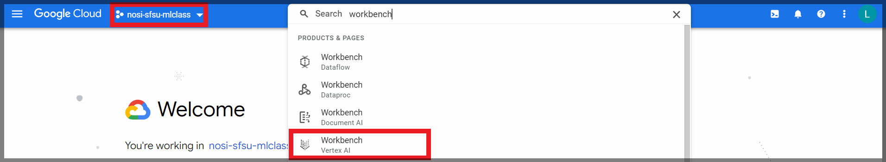

<!-- #region -->
University of San Francisco State University <br>(Intro to machine learning for Covid predictions)
---------------------------------
This module teaches you how to create a simple Decision Tree using a structured dataset. In addition to the overview given in this README you will find the four Jypiter Notebooks. The second notebook is optional.
- **1- Intro to Machine Learning: Decision Trees**: This notebook provides a basic introduction to Machine Learning concepts, steps for creating and understanding a Decision Tree model, making predictions with it and intuitively evaluate its performance. 

- **2- (Optional) Quant. Comparison of 2020 DT Model Performance for (2020 vs 2021) Data**: This notebook is optional, for student's who would like to know a bit more about how to evaluate model performance quantitatively, and offers an introduction to why machine learning models require retraining from time to time. 

- **3- Practice**: This notebook provides a way to practice and test what you have learned from the first Notebook. It includes basic intructions outlining every step discussed in the first notebook. Students are free to either copy and modify the code from the first notebook or they can choose to write it themselves.

- **4- Practice - Answer Key**: This notebook provides the answers and explanation to the previous Practice Exercise notebook. Check this notebook only after you have tried to complete the previous exercise yourself. 

## Overview of Page Contents

+ [Getting Started](#gs)
+ [Overview](#ov)
+ [Software Requirements](#sof)
+ [Workflow Diagrams](#work)
+ [Data](#data)
+ [Funding](#fund)

## **Getting Started**<a name="gs"></a> 

Included is a tutorial in the form of Jupyter notebooks. The main purpose of the tutorial is to help beginers without much coding experience to familiarize themselves with basic fundamental concepts within machine learning using health data (COVID dataset), nevertheless it is meant to be extended to other kinds of structured data. The tutorial walks through step by step the process of creating a Decision Tree and interpreting it. This module intends to provide an intuitive understanding of how machine learning model performance is evaluated. In order to get to this module from The Google Cloud Platform, you will need to have access to a Google Cloud Platform account, this module is located within Workbench/Vertex AI. For more technical information about Google Cloud Platform please click on the following link: [NIH Cloud Lab README](https://github.com/STRIDES/NIHCloudLabGCP)

### Steps to Access our Module

**1)** To use our module, sign into your Google Cloud Account, make sure you are in the **"nosi-sfsu-mlclass"** project, if not you can try to find it by clicking the down arrow next to the project name which would bring you into a separate menu where this project name should be listed. Then type in the search bar "workbench", make sure you select the one called **"Workbench Vertex AI"** as in the picture above.



**2)** Create a New Notebook and make sure you choose the first option that says **Customize...** in the menu within Workbench/ Vertex AI, like in the example shown in the picture below. This should take you to a new menu with advanced options to customize your notebook.


**3)** In the menu, make sure you input a unique notebook name. We suggest you use your own name initials such as in the example below (lm-tester). Then make sure you have the following configurations selected:


Keep scrolling down and you will see the following options as well to configure:


Choose **single user** and input the email you used to sign up to Google Cloud Console, as indicated make sure that the email is attatched to a google account:


At the end of this menu, click on the **CREATE** button.


**4)** After this it will take some time for the notebook to get started, please be patient and wait for it to be ready. It will be ready when a small green circle with a white check appears next to it. Once this happens please click **OPEN JUPYTERLAB** located next to the notebook with the name you have created in the previous step, this should take you to a separate window tab.


**5)** In the new tab, please click **File** , then go to **New** and select **Terminal**. Once inside the Terminal, clone the parent repository by typing `gcloud source repos clone nosi-sfsu-rclass --project=nosi-gmail-rclass-d644` , after the code runs a new folder will appear on the left pannel, navigate to the directory for this project to see all the materials, needed for this module.


**IMPORTANT NOTE** 

Make sure that after you are done with the Module, close the tab that appeared when you clicked **OPEN JUPYTERLAB**, then check the box next to the name of the notebook you created in step 3. Then click on **STOP** at the top of the workbench menu. Wait and make sure that the icon next to your notebook is grey out, like the example below.


## **Overview** <a name="ov"></a>

This module is geared towards beginners and does not require prior knowledge on a specific scientific discipline. The module is devided in three Jupyter notebooks as outlined at the beggining of this document. In addition to the notebooks mentioned, there are videos containing brief explanations about basic concepts in machine learning and what the code does in each step of the notebook. Below is an outline of the videos contained in each notebook with their respective links. These videos are already attatched to the notebook.

### 1- Introduction To Machine Learning: Decision Trees (10 video clips)
// links will be updated to You Tube ones eventually//
- [Introduction Video by Lorena Benitez](https://vimeo.com/721612530)
- [Objectives of Exercise](https://vimeo.com/747875559)
- [Step 1: Importing necessary packages into Google Colab](https://vimeo.com/747875607)
- [Step 2: Loading Training data and making sure it looks correct](https://vimeo.com/747875643)
- [Step 3: Separate the Training Dataset into features and labels](https://vimeo.com/747875687)
- [Step 4: Create a Decision tree object and Train it](https://vimeo.com/747875711)
- [Step 5: Visualize our trained Decision Tree](https://vimeo.com/747875740)
- [Step 6: Make predictions using Testing data with our trained Decision Tree](https://vimeo.com/747875773)
- [Step 7: Let's see How our Decicion Tree Model Performed](https://vimeo.com/747875827)
- [Step 8) Let's try using our Summer 2020 Tree model to predict 2021 Data](https://vimeo.com/714289135)

### 2-  (Optional) Quant. Comparison of 2020 DT Model Performance for (2020 vs 2021) Data

### 3-  Practice Exercise ( No video clips)
- [Walkthrough Solution](https://vimeo.com/714289066)
### 4- Practice Exercise - Answer Key (1 video clip)
- [Walkthrough Solution](https://vimeo.com/714289066)


## **Software Requirements**<a name="sof"></a>

Software requirements are satisfied by using a pre-made Google Cloud Platform environment Workbench Notebook. The Notebook environment used is named **"Python 3 with Intel® MKL"** ; and it is listed during Step 3 for accessing our module. In addition all package requirements are installed by following the instructions Step 1 of the notebook **"Intro to Machine Learning Decision Trees"**
    
## **Workflow Diagrams** <a name="work"></a>

Submodule 1 and Submodule 3 will read csv files contained into the local folder named **"data"** within this repository, then it will output CSV files that will be used optionally if students want to work on the (optional) Submodule 2. Below is a diagram that illustrates our workflow:


## **Data** <a name="data"></a>
All original data from this module was originally sourced from the following sites: 

- [Covid cases data (California Health and Human Services Agency)](https://data.chhs.ca.gov/dataset/covid-19-time-series-metrics-by-county-and-state/resource/046cdd2b-31e5-4d34-9ed3-b48cdbc4be7a)
- [Covid Vaccination data (Los Angeles Times)](https://github.com/datadesk/california-coronavirus-data)
- [Unemployment data (California Employment Development Dept.)](https://data.edd.ca.gov/Labor-Force-and-Unemployment-Rates/Local-Area-Unemployment-StatisticsdecisionLAUS-/e6gw-gvii)
- [Election data (Harvard University)](https://dataverse.harvard.edu/dataset.xhtml?persistentId=doi:10.7910/DVN/VOQCHQ)

We subsequently picked only certain variables of interest, cleaned and created a composite dataset for the years 2020 and 2021 from the sources listed above. **We manipulated the variable named "Unemployment_rate" by using the 2020 rates in both the 2020 and 2021 Datasets**. We then separated these datasets into training, validation and testing sets for each of these years to streamline the tutorials. Finally, we stored them in our private [SFSU github repository](https://github.com/MarcMachineLearning/Introduction-to-Machine-Learning/tree/main/Datasets). 

## **Funding** <a name="fund"></a>

- SFSU/UCSF M.S. Bridges to the Doctorate Program: cloud-based learning modules supplement (T32GM142515)
- Demystifying Machine Learning and Best Data Practices Workshop Series for Underrepresented STEM Undergraduate and MS  Researchers bound for PhD Training Programs (T34-GM008574)                                                                        
<!-- #endregion -->

```python

```
